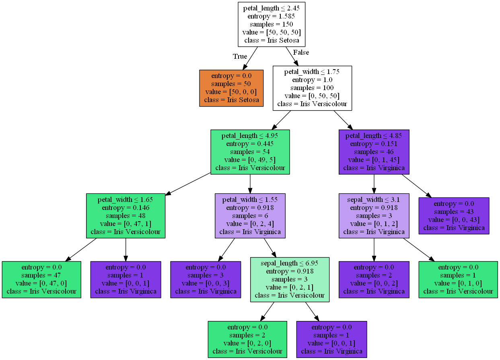

# Iris Flowers Classification

## Table of contents

1. [Introduction](#intro)
2. [Classification Models](#models)
    - K Nearest Neighbours
    - Decision Tree
    - Support Vector Machine 
    - Logistic Regression   
3. [Results](#results)
4. [Conclusion](#conclusion)

## Introduction:

**Iris** is a genus of around 300 species of flowering plants. It takes the name from the Greek goddess of rainbow, *Iris*. 

The **Iris flower data set** is also know as the **Fisher's Iris data set**. It is a multivariate data set introduced by Ronald Fisher in his paper, **The use of multiple measurements in taxonomic problems** as an example of linear discriminant analysis.

The data set is available at https://archive.ics.uci.edu/ml/datasets/iris, the errors are modified as well. It consists the following information for 150 samples,

1. sepal length (in cm)
2. sepal width (in cm)
3. petal length (in cm)
4. petal width (in cm)
5. class:
    - Iris Setosa
    - Iris Versicolour
    - Iris Virginica
    
Download and save the dataset into the same folder as this program.

## Classification Models:

**Classification models** can be used to predict the dependent variable (**_class of each flower_**). Here we are going to use 4 different algorithms for classification namely, **K-Nearest Neighbours**, **Decision Tree**, **Support Vector Machine** and **Linear Regression**. Atlast we compare their accuracy to find the suitable classification technique for this problem. The given dataset is seperated into two seperate train and test sets. The train set is used to train the model, and the test set is used to predict the accuracy of each model. Finally, we compare the results. Here, 70% of the dataset was considered for training and 30% of the dataset for testing. 

### Accuracy of each model using the test data:

| Algorithm               |  Jaccard Similarity Score  |  F1 score  |  Log Loss  |
|-------------------------|----------------------------|------------|------------|
| K Nearest Neighbour     | 0.91                       | 0.91       | NA         |
| Decision Tree           | 0.93                       | 0.93       | NA         |
| Support Vector Machine  | 0.91                       | 0.91       | NA         |
| Logistic Regression     | 0.84                       | 0.83       | 0.84       |

Comparing the scores and accuarcy of each model, it is seen the **Decision Tree** classification algorithm provides the highest accuracy for this problem using the Iris Data Set.

## Results:

It is always the best practice to train the model using the complete dataset i.e. not to waste any part of the available data. Thus, the complete dataset was modelled using Decision Tree Classifier. Let us visualize the tree:

  

## Conclusion:

The purpose of this project was to compare different classification algorithms to predict the class of the iris flowers. Find and compare the accuracy of each model to find the best classifier. Finally train the model using the complete dataset.

The **final_model** computed here can be used to predict the class of the iris flowers as **Iris Setosa (or) Iris Versicolour (or) Iris Virginica** given its attribute information namely the **sepal length, sepal width, petal length and petal width** values in centimeter.

Refer [iris_classification](iris_classification.ipynb) for the code to compare the Classification Models.  
Refer [iris_decision_tree](iris_decision_tree.ipynb) for the code to visualize the Decision Tree Model.

## Thank you

I hope you found the project useful and interesting. Feel free to contact me if you have any queries or suggestions.

-- [Rohith S P](https://www.linkedin.com/in/rohithsp/) 
